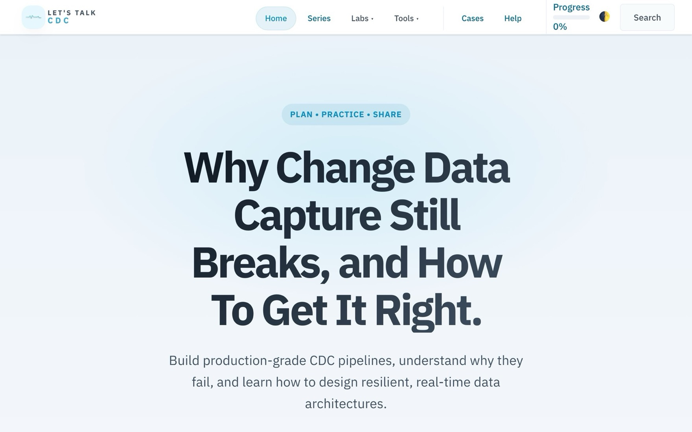
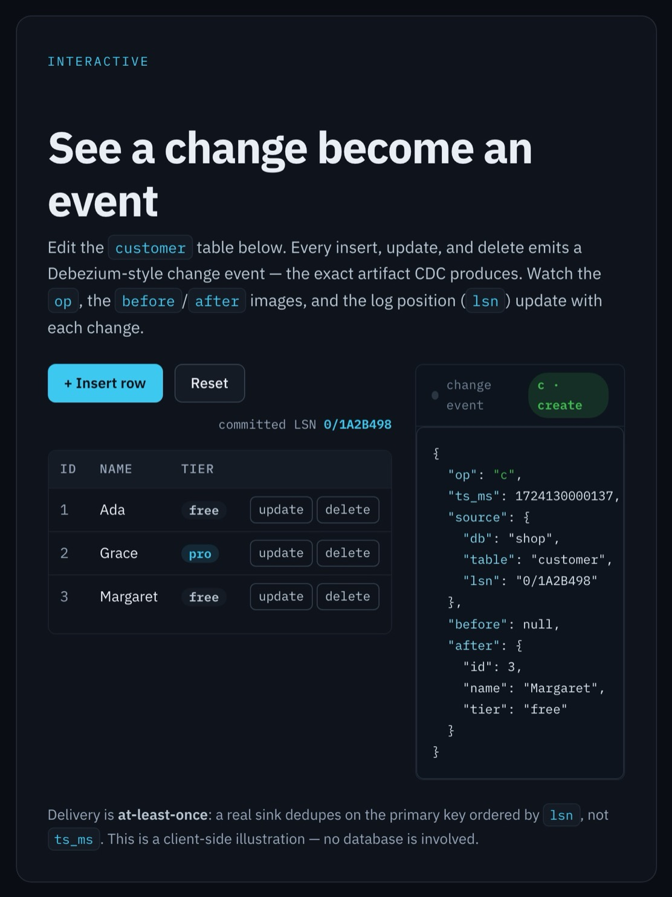
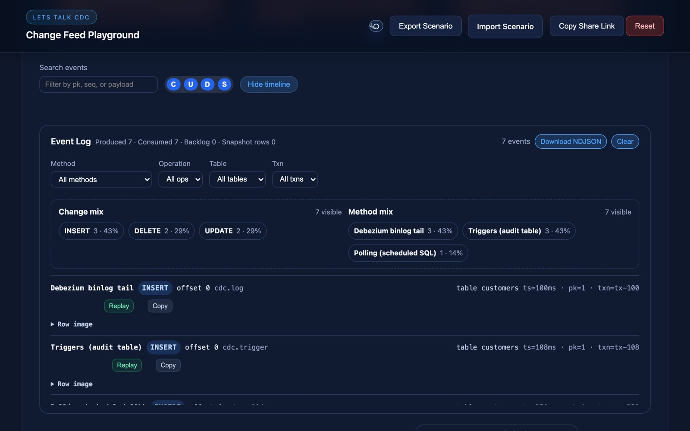
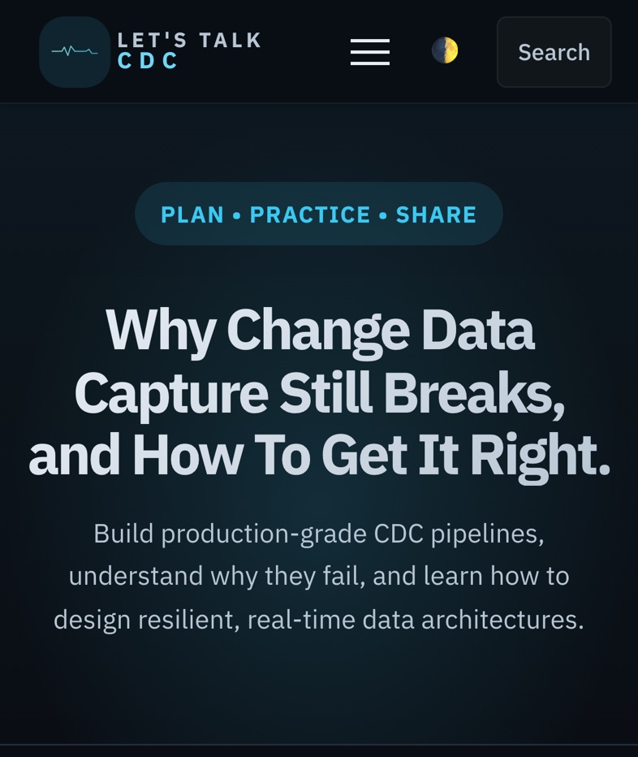

# CDC: The Missing Manual

**A practitioner's guide to change data capture: what the events mean, what breaks in production, and how to build sinks that stay correct.**

[Read the manual](https://sandgraal.github.io/letstalkcdc/) · [Start with the introduction](https://sandgraal.github.io/letstalkcdc/intro/) · [Try the playground](https://sandgraal.github.io/letstalkcdc/playground/)

<picture>
  <source media="(prefers-color-scheme: dark)" srcset="docs/images/readme/hero-dark.jpg">
  
</picture>

[](https://github.com/sandgraal/letstalkcdc/actions/workflows/ci.yml)
[](https://github.com/sandgraal/letstalkcdc/actions/workflows/linkcheck.yml)
[](LICENSE-CONTENT.md)

_CDC: The Missing Manual_ (also called Let's Talk CDC) is a free, no-sign-up guide for engineers who run, or are about to run, change data capture pipelines. If you can read SQL and have seen a message queue, you are ready.

## What you'll learn

Change data capture (CDC) reads a database's transaction log and turns each committed row change into an event that other systems can consume: a warehouse, a cache, a search index, another service. It often replaces nightly batch jobs with a stream. Capturing the changes is the easy part. Applying them correctly downstream is where pipelines go wrong.

The manual argues one thesis, and every module comes back to it:

1. **Delivery is at-least-once.** Expect duplicates, replays and connector restarts.
2. **Correctness lives in the sink.** Write idempotently, keyed on the primary key and ordered by log position (LSN, SCN, GTID), not by `ts_ms`.
3. **End-to-end exactly-once across independent systems is not achievable.** What you can build is exactly-once _processing_: at-least-once transport plus an idempotent sink.

Here is a change event, in the shape the [introduction's event demo](https://sandgraal.github.io/letstalkcdc/intro/#cdc-event-demo) produces (the [event envelope](https://sandgraal.github.io/letstalkcdc/event-envelope/) module explains each field):

```json
{
  "op": "u",
  "ts_ms": 1724130000137,
  "source": { "db": "shop", "table": "customer", "lsn": "0/1A2B498" },
  "before": { "id": 1, "name": "Ada", "tier": "free" },
  "after": { "id": 1, "name": "Ada", "tier": "pro" }
}
```

`ts_ms` is a wall-clock time. Clocks drift, and two commits can share a millisecond. The `lsn` is the change's position in the source's log, and that is what you order by.

## Start here

Take it in this order if you are new to CDC:

1. [Interactive Introduction](https://sandgraal.github.io/letstalkcdc/intro/): the core ideas, with a live event demo.
2. [Event Envelope](https://sandgraal.github.io/letstalkcdc/event-envelope/): what is inside an event and what delivery guarantees mean.
3. [Exactly-Once Semantics](https://sandgraal.github.io/letstalkcdc/exactly-once/): why the sink has to be idempotent.
4. [Snapshotting](https://sandgraal.github.io/letstalkcdc/snapshotting/) and [Materialization 101](https://sandgraal.github.io/letstalkcdc/materialization/): the first sync, then applying changes.
5. A [Quickstart](https://sandgraal.github.io/letstalkcdc/quickstarts/) for Postgres, MySQL, Oracle or SQL Server.
6. [Failure Drills](https://sandgraal.github.io/letstalkcdc/troubleshooting/failure-drills/): break it on purpose and recover.

<details>
<summary>All 36 modules, by stage</summary>

| Module                                                                                                         | Level        | What it covers                                                     |
| -------------------------------------------------------------------------------------------------------------- | ------------ | ------------------------------------------------------------------ |
| **Core concepts**                                                                                              |              |                                                                    |
| [Interactive Introduction](https://sandgraal.github.io/letstalkcdc/intro/)                                     | Beginner     | The core ideas, methods, architectures and tooling                 |
| [Event Envelope](https://sandgraal.github.io/letstalkcdc/event-envelope/)                                      | Beginner     | Keys, before/after images, tombstones, delivery guarantees         |
| [Materialization 101](https://sandgraal.github.io/letstalkcdc/materialization/)                                | Intermediate | MERGE patterns for upserts and deletes                             |
| [Snapshotting](https://sandgraal.github.io/letstalkcdc/snapshotting/)                                          | Intermediate | The initial consistent snapshot before live changes                |
| [CDC Beyond Relational Databases](https://sandgraal.github.io/letstalkcdc/non-relational/)                     | Intermediate | MongoDB, DynamoDB Streams and Cassandra                            |
| **Advanced patterns**                                                                                          |              |                                                                    |
| [Exactly-Once Semantics](https://sandgraal.github.io/letstalkcdc/exactly-once/)                                | Advanced     | At-least-once versus exactly-once, the outbox                      |
| [Is CDC Exactly-Once? Per Hop](https://sandgraal.github.io/letstalkcdc/is-cdc-exactly-once/)                   | Advanced     | Check any exactly-once claim hop by hop                            |
| [CDC Without Kafka](https://sandgraal.github.io/letstalkcdc/non-kafka-cdc/)                                    | Advanced     | Debezium Server, the embedded engine, managed services             |
| [Transactional Outbox and Relay](https://sandgraal.github.io/letstalkcdc/transactional-outbox/)                | Advanced     | Why dual writes fail, and how consumers dedupe and order           |
| [Partitioning](https://sandgraal.github.io/letstalkcdc/partitioning/)                                          | Advanced     | Partition keys, skew, late arrivals                                |
| [Which Row Wins in Your Target](https://sandgraal.github.io/letstalkcdc/which-row-wins/)                       | Advanced     | Ordering and delete markers in BigQuery, Iceberg, Delta, Snowflake |
| [Schema Evolution](https://sandgraal.github.io/letstalkcdc/schema-evolution/)                                  | Advanced     | Compatibility rules and schema registries                          |
| [Data Contracts for Database Events](https://sandgraal.github.io/letstalkcdc/cdc-data-contracts/)              | Advanced     | What a consumer may rely on, and a gate that catches breaks        |
| [Deletes That Stay Deleted](https://sandgraal.github.io/letstalkcdc/deletes-stay-deleted/)                     | Advanced     | Tombstones, delete markers and late-update resurrection            |
| [Multi-Tenancy](https://sandgraal.github.io/letstalkcdc/multi-tenancy/)                                        | Advanced     | Isolation patterns, topic math, egress estimates                   |
| [Reconciliation & Offset Surgery](https://sandgraal.github.io/letstalkcdc/reconciliation-surgery/)             | Advanced     | Repairing sinks, resetting offsets safely                          |
| **Running it**                                                                                                 |              |                                                                    |
| [Offsets & Replays](https://sandgraal.github.io/letstalkcdc/ops-offsets/)                                      | Intermediate | Offset stores, safe rewind, resync drills                          |
| [Observability](https://sandgraal.github.io/letstalkcdc/observability/)                                        | Intermediate | Lag, throughput, error rate, minimal dashboards                    |
| [Postgres Replication Slots & WAL Growth](https://sandgraal.github.io/letstalkcdc/postgres-replication-slots/) | Intermediate | A runbook for a disk filling behind a CDC slot                     |
| [SQL Server & MySQL CDC Specifics](https://sandgraal.github.io/letstalkcdc/sql-server-mysql-cdc/)              | Intermediate | Positions, retention, binlog purge, GTIDs and LSNs                 |
| [Backfill and Re-Snapshot Safely](https://sandgraal.github.io/letstalkcdc/backfill-resnapshot/)                | Advanced     | Reload history without overwriting newer changes                   |
| [Security, PII & Access Control](https://sandgraal.github.io/letstalkcdc/security/)                            | Intermediate | Masking, least privilege, logs that outlive rows                   |
| **Context**                                                                                                    |              |                                                                    |
| [Use Cases](https://sandgraal.github.io/letstalkcdc/use-cases/)                                                | Beginner     | Real-time analytics to cache invalidation                          |
| [The Strategic Value of CDC](https://sandgraal.github.io/letstalkcdc/strategy/)                                | Beginner     | The business case                                                  |
| [The CDC Ecosystem](https://sandgraal.github.io/letstalkcdc/tooling/)                                          | Beginner     | Open-source and commercial tools                                   |
| [Real-World Case Study](https://sandgraal.github.io/letstalkcdc/case-study/)                                   | Intermediate | From batch ETL to CDC, with the trade-offs                         |
| **Hands-on**                                                                                                   |              |                                                                    |
| [Quickstarts](https://sandgraal.github.io/letstalkcdc/quickstarts/)                                            | Beginner     | Pick a source database, 10 to 20 minutes                           |
| [Kafka + Debezium Lab](https://sandgraal.github.io/letstalkcdc/lab-kafka-debezium/)                            | Intermediate | Kafka, Connect, a Postgres source and sink                         |
| [Cloud CDC Labs](https://sandgraal.github.io/letstalkcdc/cloud-labs/)                                          | Intermediate | AWS DMS, Snowflake and Matillion end to end                        |
| [Acceptance Tests](https://sandgraal.github.io/letstalkcdc/tests/)                                             | Intermediate | Scripts that check your lab survives restarts                      |
| [Testing a CDC Pipeline](https://sandgraal.github.io/letstalkcdc/test-your-pipeline/)                          | Intermediate | Contract, duplicate, out-of-order and replay tests                 |
| [Failure Scenario Drills](https://sandgraal.github.io/letstalkcdc/troubleshooting/failure-drills/)             | Advanced     | Backpressure, DLQs, schema drift, offset replays                   |
| **Tools and errata**                                                                                           |              |                                                                    |
| [Connector Config Builder](https://sandgraal.github.io/letstalkcdc/connector-builder/)                         | Intermediate | Debezium configs for Postgres, MySQL or Oracle                     |
| [Debezium Event Decoder](https://sandgraal.github.io/letstalkcdc/debezium-decoder/)                            | Intermediate | Before/after diffs and MERGE-ready SQL                             |
| [DLQ Triage Assistant](https://sandgraal.github.io/letstalkcdc/dlq-triage/)                                    | Advanced     | Commands and playbooks for re-driving DLQ events                   |
| [Nuances & Errata](https://sandgraal.github.io/letstalkcdc/errata/)                                            | Advanced     | Corrections and sharp edges                                        |

The [merge cookbook](https://sandgraal.github.io/letstalkcdc/merge-cookbook/) is a reference page with sink MERGE templates. It sits alongside the modules and is not counted among them.

</details>

## Try it

Many modules end with a short quiz, and your progress is kept in your browser on the [progress page](https://sandgraal.github.io/letstalkcdc/dashboard/). Press `/` (or tap Search) on any page to search.



- **Event demo.** Insert, update and delete rows in a small customer table and watch the [change event](https://sandgraal.github.io/letstalkcdc/intro/#cdc-event-demo) each one emits.
- **Change Feed Playground.** A browser [simulator](https://sandgraal.github.io/letstalkcdc/playground/). Model a table, insert, update and delete by primary key, emit a snapshot, then inspect the Debezium-style events or copy them as NDJSON.
- **Debezium tools.** Build a connector config, decode a pasted event, or work through a dead-letter queue with the Connector Config Builder, Debezium Event Decoder and DLQ Triage Assistant (see the full module list above).
- **Run a real stack.** `docker compose up -d` starts Postgres, MySQL, Kafka, Debezium Connect and Kafka UI on your machine. See the [sandbox guide](docs/SANDBOX.md).



It works on a phone, and has a light and a dark theme:



## Reading paths

- **I have ten minutes.** Play with the [event demo](https://sandgraal.github.io/letstalkcdc/intro/#cdc-event-demo), read [Exactly-Once Semantics](https://sandgraal.github.io/letstalkcdc/exactly-once/), and keep the [glossary](https://sandgraal.github.io/letstalkcdc/glossary/) open.
- **I run Debezium in production.** Start with the [first 15 minutes of an incident](https://sandgraal.github.io/letstalkcdc/troubleshooting/), then [snapshotting](https://sandgraal.github.io/letstalkcdc/snapshotting/), [schema evolution](https://sandgraal.github.io/letstalkcdc/schema-evolution/), [offsets and replays](https://sandgraal.github.io/letstalkcdc/ops-offsets/), [security](https://sandgraal.github.io/letstalkcdc/security/) and the [errata](https://sandgraal.github.io/letstalkcdc/errata/). The [merge cookbook](https://sandgraal.github.io/letstalkcdc/merge-cookbook/) has sink templates.
- **I'm choosing a tool.** Read the [platform comparison](https://sandgraal.github.io/letstalkcdc/compare/) (read the delivery-semantics row first), then the [ecosystem overview](https://sandgraal.github.io/letstalkcdc/tooling/), the [strategy](https://sandgraal.github.io/letstalkcdc/strategy/) module and the [case study](https://sandgraal.github.io/letstalkcdc/case-study/).

## Why trust it

- **Vendor-neutral first.** Concepts come in general terms, then map to stacks such as Debezium, Kafka, Snowflake and Matillion.
- **Corrections are public.** See the [errata](https://sandgraal.github.io/letstalkcdc/errata/) and the [methodology](https://sandgraal.github.io/letstalkcdc/methodology/) page on how claims are checked.
- **Checked by machines.** Every change runs [unit, pa11y, axe and Lighthouse checks](.github/workflows/ci.yml), and a [link check](.github/workflows/linkcheck.yml) crawls the built site.
- **Minimal, disclosed data collection.** The site's own code sets no cookies. When the maintainer enables it, it counts page views with GoatCounter (no cookies, no cross-site tracking, Do Not Track respected; not loaded on the playground). An optional newsletter signup sends the address you type to Buttondown only when you press Subscribe. The assistant's 👍/👎 and the playground's saved scenarios and change events go to a Supabase database, and a few pages load Mermaid, Chart.js or the Supabase library from a CDN. Everything is listed on the [privacy page](https://sandgraal.github.io/letstalkcdc/privacy/), which is the source of truth.
- **The assistant is optional.** A thumbs-up or thumbs-down can store your last typed question with the vote, so don't paste secrets into it ([privacy note](https://sandgraal.github.io/letstalkcdc/privacy/), [SECURITY.md](SECURITY.md)).

## Found a mistake? Want to help?

If something is wrong, unclear or out of date, please [open an issue](https://github.com/sandgraal/letstalkcdc/issues) or start a [discussion](https://github.com/sandgraal/letstalkcdc/discussions). Corrections with a source are the most useful kind.

**Developers and contributors: start with [docs/DEVELOPMENT.md](docs/DEVELOPMENT.md)** for running the site locally, then [docs/CONTRIBUTING.md](docs/CONTRIBUTING.md). Reviewing the whole project? Start with the [autopsy briefing pack](docs/AUTOPSY-BRIEF.md).

## Author and license

Written and maintained by [Christopher Ennis](https://www.linkedin.com/in/cennis/) ([GitHub](https://github.com/sandgraal)).

Code is MIT ([LICENSE](LICENSE)). Written lessons, diagrams and images are CC BY 4.0 ([LICENSE-CC-BY-4.0.txt](LICENSE-CC-BY-4.0.txt)). Which files fall under which licence is in [LICENSE-CONTENT.md](LICENSE-CONTENT.md). To reuse the content, attribute it like this:

> CDC: The Missing Manual by Christopher Ennis (Let's Talk CDC), https://sandgraal.github.io/letstalkcdc/, licensed under CC BY 4.0 (https://creativecommons.org/licenses/by/4.0/)
