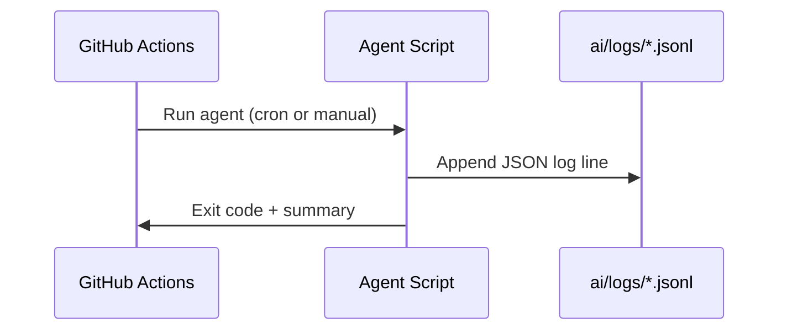

# DATAFLOW.md

High-level flows. Adapt to your stack.

## Content Build
```mermaid
flowchart LR
  A[Markdown/MDX + Data] --> B[SSG Build]
  B --> C[Static Output (_site or dist)]
  C --> D[GitHub Pages or Static Hosting]
```

## Product Data → Pages
```mermaid
flowchart LR
  D1[products.(json|js|yaml)] --> E[Collections / Data Cascade]
  E --> F[Templates / Layouts]
  F --> G[Product Pages + Feeds]
```

## Agents + Logs

