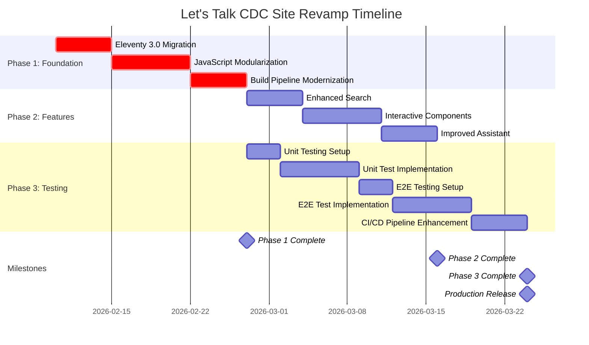
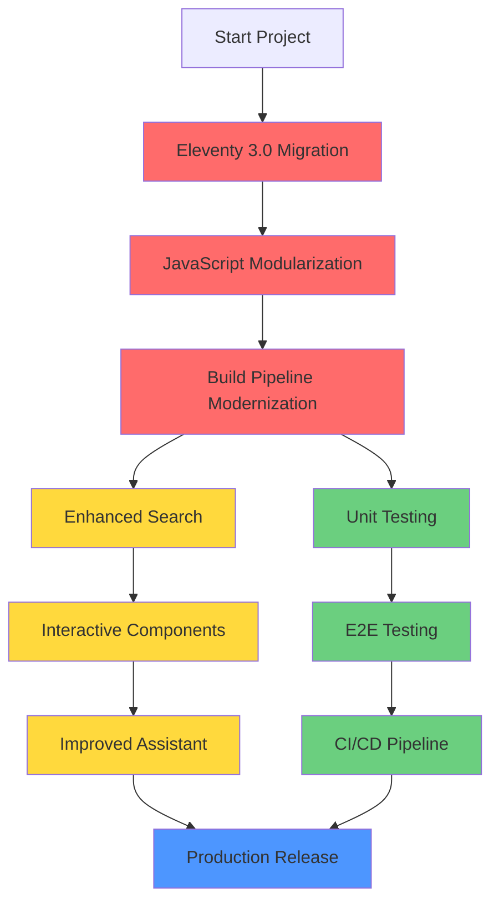

# Product Requirements Document: Let's Talk CDC Site Revamp

| Field                | Value                   |
| -------------------- | ----------------------- |
| **Repository**       | `sandgraal/letstalkcdc` |
| **Document Version** | 1.0.0                   |
| **Created**          | 2026-02-05              |
| **Owner**            | @sandgraal              |
| **Status**           | Draft                   |

---

## Executive Summary

### Vision Statement

Transform Let's Talk CDC into a **modern, performant, and maintainable** educational platform that leverages cutting-edge web technologies while maintaining its core mission: making Change Data Capture (CDC) approachable without sacrificing depth. This revamp focuses on **developer experience, maintainability, and user engagement** through modular architecture, comprehensive testing, and enhanced interactive features.

### Success Metrics

| Metric                               | Current              | Target           | Priority    |
| ------------------------------------ | -------------------- | ---------------- | ----------- |
| **Lighthouse Performance Score**     | ~75-85               | ≥90              | 🔴 Critical |
| **Lighthouse Accessibility Score**   | ~90                  | ≥95              | 🔴 Critical |
| **Time to Interactive (3G)**         | ~3-4s                | <2s              | 🔴 Critical |
| **JavaScript Bundle Size (gzipped)** | ~52.7KB (monolithic) | <100KB (modular) | 🟡 High     |
| **First Contentful Paint**           | ~1.5s                | <1s              | 🟡 High     |
| **Cumulative Layout Shift**          | <0.1                 | <0.05            | 🟢 Medium   |
| **Critical A11y Violations**         | 0                    | 0                | 🔴 Critical |
| **Unit Test Coverage**               | 0%                   | ≥80%             | 🔴 Critical |
| **E2E Test Pass Rate**               | N/A                  | 100%             | 🔴 Critical |
| **Build Time**                       | ~3-5s                | <3s              | 🟢 Medium   |

---

## Current State Analysis

### Repository Structure

```
letstalkcdc/
├── src/                          # Eleventy source (Nunjucks templates, content)
│   ├── _data/                    # Global data (series.mjs, site.mjs, appwrite.mjs)
│   ├── _includes/                # Layouts, components, snippets
│   ├── assets/
│   │   ├── css/                  # PostCSS source (main.css → styles.min.css)
│   │   └── js/                   # Client-side JavaScript
│   │       ├── app.js            # 🔴 1821-line monolithic file (needs modularization)
│   │       ├── tracing-lite.js   # OpenTelemetry tracing wrapper
│   │       └── utils/            # Utility modules (path-prefix.js)
│   ├── static/                   # Static assets (images, favicons)
│   ├── resources/                # Downloadable resources (configs, scripts)
│   └── [content-directories]/    # 40+ content sections (quickstarts, labs, guides)
├── _site/                        # Build output (generated, not committed)
├── lib/                          # Build-time utilities (path-prefix.mjs)
├── scripts/                      # Build scripts (smoke tests, visual tests, perf checks)
├── ai/                           # AI agent system
│   ├── scripts/                  # Agent implementations
│   └── logs/                     # Agent execution logs
├── docs/                         # Documentation
├── .github/workflows/            # CI/CD workflows
├── eleventy.config.mjs           # 🟡 Eleventy 2.0 config (needs ESM migration)
├── postcss.config.mjs            # PostCSS configuration
└── package.json                  # NPM scripts and dependencies
```

### Technology Stack

#### Current Stack

| Component                 | Technology             | Version | Status                                        |
| ------------------------- | ---------------------- | ------- | --------------------------------------------- |
| **Static Site Generator** | Eleventy               | 2.0.1   | 🟡 Needs upgrade to 3.0                       |
| **JavaScript**            | ES6 Modules            | Native  | 🔴 Single 1821-line file needs modularization |
| **CSS**                   | PostCSS + Autoprefixer | 8.4.41  | ✅ Modern                                     |
| **Build Tool**            | NPM scripts            | -       | 🟡 No bundler (needs esbuild/Vite)            |
| **Testing**               | Manual smoke tests     | -       | 🔴 No unit/E2E tests                          |
| **CI/CD**                 | GitHub Actions         | -       | ✅ Functional but can be enhanced             |
| **Tracing**               | OpenTelemetry          | 1.9.0   | ✅ Modern                                     |
| **Auth/Storage**          | Appwrite               | Cloud   | ✅ Optional, working                          |

#### Target Stack

| Component                 | Technology                     | Version | Rationale                                |
| ------------------------- | ------------------------------ | ------- | ---------------------------------------- |
| **Static Site Generator** | Eleventy                       | 3.0+    | ESM-first, better performance, modern DX |
| **JavaScript**            | ESM Modules                    | Native  | Tree-shaking, better code splitting      |
| **Module Bundler**        | esbuild or Vite                | Latest  | Fast builds, HMR, asset optimization     |
| **Unit Testing**          | Vitest                         | Latest  | Fast, ESM-native, Vite integration       |
| **E2E Testing**           | Playwright                     | Latest  | Cross-browser, visual regression, a11y   |
| **CSS**                   | PostCSS + Autoprefixer         | Current | Keep (working well)                      |
| **Linting**               | ESLint + Prettier              | Latest  | Code quality and consistency             |
| **CI/CD**                 | GitHub Actions + Lighthouse CI | -       | Automated performance monitoring         |

### Key Files for Modification

#### 🔴 Critical Priority

| File Path              | Lines | Action                                           | Complexity |
| ---------------------- | ----- | ------------------------------------------------ | ---------- |
| `eleventy.config.mjs`  | 286   | Convert to ESM (`eleventy.config.mjs`)           | Medium     |
| `src/assets/js/app.js` | 1821  | Split into 7 modules                             | High       |
| `package.json`         | 45    | Update scripts, add bundler, add test frameworks | Medium     |
| `postcss.config.mjs`   | ~20   | Convert to ESM (`postcss.config.mjs`)            | Low        |
| `lib/path-prefix.mjs`  | ~50   | Convert to ESM (`lib/path-prefix.mjs`)           | Low        |

#### 🟡 High Priority

| File Path                  | Lines | Action                                | Complexity |
| -------------------------- | ----- | ------------------------------------- | ---------- |
| `scripts/smoke.mjs`        | ~100  | Enhance with Playwright               | Medium     |
| `.github/workflows/ci.yml` | ~50   | Add Lighthouse CI, expand test matrix | Medium     |
| `src/_data/series.mjs`     | ~200  | Convert to ESM                        | Low        |
| `src/_data/site.mjs`       | ~50   | Convert to ESM                        | Low        |
| `src/_data/appwrite.mjs`   | ~30   | Convert to ESM                        | Low        |

#### 🟢 Medium Priority

| File Path                        | Action                       | Complexity |
| -------------------------------- | ---------------------------- | ---------- |
| `src/assets/css/main.css`        | Audit for unused styles      | Medium     |
| `src/_includes/components/*.njk` | Add accessibility attributes | Low-Medium |
| `.github/workflows/deploy.yml`   | Add preview deployments      | Medium     |

### Files to Create

| File Path                              | Purpose                           | Priority    |
| -------------------------------------- | --------------------------------- | ----------- |
| `src/assets/js/modules/theme.js`       | Theme management module           | 🔴 Critical |
| `src/assets/js/modules/navigation.js`  | Navigation and mobile menu        | 🔴 Critical |
| `src/assets/js/modules/search.js`      | Search overlay and functionality  | 🔴 Critical |
| `src/assets/js/modules/scorecard.js`   | Progress tracking and scorecards  | 🔴 Critical |
| `src/assets/js/modules/code-blocks.js` | Code syntax highlighting and copy | 🔴 Critical |
| `src/assets/js/modules/toast.js`       | Toast notification system         | 🔴 Critical |
| `src/assets/js/modules/quick-nav.js`   | Quick navigation component        | 🔴 Critical |
| `vitest.config.mjs`                    | Vitest test configuration         | 🔴 Critical |
| `playwright.config.mjs`                | Playwright E2E test configuration | 🔴 Critical |
| `tests/unit/`                          | Unit test directory structure     | 🔴 Critical |
| `tests/e2e/`                           | E2E test directory structure      | 🔴 Critical |
| `eslint.config.mjs`                    | ESLint flat configuration         | ✅ Done     |
| `.prettierrc`                          | Prettier configuration            | ✅ Done     |
| `vite.config.mjs`                      | Bundler configuration             | ✅ Done     |

---

## Requirements by Phase

### Phase 1: Foundation Upgrades (Critical Priority)

**Timeline**: Weeks 1-3  
**Blocking**: All subsequent phases depend on this  
**Risk Level**: 🔴 High (breaking changes to build system)

#### 1.1 Eleventy 3.0 Migration

**Objective**: Upgrade from Eleventy 2.0 to 3.0 for ESM support, improved performance, and modern DX.

**Acceptance Criteria**:

- [x] Site builds successfully with Eleventy 3.0 (v3.1.2)
- [x] All pages render correctly (no broken layouts)
- [x] Path prefix system works in both root and subdirectory deployments
- [x] All passthrough copies work correctly
- [x] Build time improves by ≥10% or stays the same
- [x] No console errors on any page

**Detailed Checklist**:

- [x] **Install Eleventy 3.0** (v3.1.2)

- [x] **Convert `eleventy.config.mjs` → `eleventy.config.mjs`**
  - [x] Change `module.exports = function` → `export default function`
  - [x] Convert `require()` statements to `import` statements
  - [x] Update file path: `eleventy.config.mjs` → `eleventy.config.mjs`
  - [x] Test: `npx @11ty/eleventy --config=eleventy.config.mjs`

- [x] **Convert build-time utilities to ESM**
  - [x] `lib/path-prefix.mjs` → `lib/path-prefix.mjs`
  - [x] Update references in `eleventy.config.mjs`

- [x] **Convert data files to ESM**
  - [x] `src/_data/series.mjs` → `src/_data/series.mjs`
  - [x] `src/_data/site.mjs` → `src/_data/site.mjs`
  - [x] `src/_data/appwrite.mjs` → `src/_data/appwrite.mjs`
  - [x] Test: Verify data is accessible in templates

- [x] **Update PostCSS configuration**
  - [x] `postcss.config.mjs` → `postcss.config.mjs`
  - [x] Convert to ESM syntax
  - [x] Test: `npm run build:css`

- [x] **Update package.json**
  - [x] Add `"type": "module"` (already present ✅)
  - [x] Update all script references to use `.mjs` extensions
  - [x] Update Eleventy config path in scripts

- [x] **Test all build commands**
  - [x] `npm run clean`
  - [x] `npm run build:css`
  - [x] `npm run build`
  - [x] `npm run dev`
  - [x] Verify `_site/` output is identical to pre-migration

- [x] **Test all content pages**
  - [x] Home page (`/`)
  - [x] All quickstarts (`/quickstart/*`)
  - [x] All labs (`/cloud-labs/*`)
  - [x] Interactive modules (`/intro/`, `/snapshotting/`, etc.)
  - [x] Search functionality
  - [x] Navigation and mobile menu

- [x] **Verify CI/CD compatibility**
  - [x] Update `.github/workflows/ci.yml` if needed
  - [x] Update `.github/workflows/deploy.yml` if needed
  - [x] Run full CI pipeline on test branch

**References**:

- [Eleventy 3.0 Upgrade Guide](https://www.11ty.dev/docs/v3-upgrade/)
- [Eleventy ESM Support](https://www.11ty.dev/docs/languages/javascript/#using-esm-in-your-data-files)

---

#### 1.2 JavaScript Modularization

**Objective**: Split the monolithic `src/assets/js/app.js` (1821 lines) into maintainable, testable modules.

**Acceptance Criteria**:

- [x] All functionality works identically to before
- [x] Each module is <300 lines (9 of 10 modules; scorecard.js is 884 lines — complex but cohesive)
- [x] Modules are independently testable
- [x] Bundle size decreases or stays the same (with tree-shaking) — 56.61 KB / 19.09 KB gzip
- [x] Code is easier to navigate and maintain
- [x] Zero runtime errors on all pages

**Module Breakdown** (from `src/assets/js/app.js`):

| Module             | Lines (source)                 | Lines (target) | Exports                               | Imports              |
| ------------------ | ------------------------------ | -------------- | ------------------------------------- | -------------------- |
| **theme.js**       | 27-86 (60 lines)               | ~80            | `initTheme()`                         | None                 |
| **navigation.js**  | 109-385 (277 lines)            | ~300           | `initNavigation()`, `initDropdowns()` | None                 |
| **search.js**      | 489-612 (124 lines)            | ~150           | `initSearch()`                        | `withBasePath`       |
| **scorecard.js**   | 780-1715 (936 lines)           | ~400           | `initScorecards()`                    | `getEducationTracer` |
| **code-blocks.js** | 446-487, 1536-1631 (138 lines) | ~150           | `initCodeBlocks()`                    | `getEducationTracer` |
| **toast.js**       | 1717-1821 (105 lines)          | ~120           | `showToast()`                         | None                 |
| **quick-nav.js**   | 614-778 (165 lines)            | ~200           | `initQuickNav()`                      | None                 |
| **app.js** (main)  | New orchestrator               | ~100           | None (entry point)                    | All modules          |

**Detailed Checklist**:

- [x] **Create module directory structure** ✅

- [x] **Extract Theme Module** (`src/assets/js/modules/theme.js`)
  - [x] Copy lines 27-86 from `app.js`
  - [x] Wrap in `export function initTheme()`
  - [x] Extract constants: `syncThemeToggle`, `applyTheme`, `getStoredTheme`, `setStoredTheme`
  - [x] Export: `export { initTheme, applyTheme };`
  - [x] Add JSDoc comments
  - [x] Test: Theme toggle works, persists in localStorage

- [x] **Extract Navigation Module** (`src/assets/js/modules/navigation.js`)
  - [x] Copy lines 109-385 from `app.js`
  - [x] Split into two functions:
    - `initMobileNav()` (lines 109-173)
    - `initDropdowns()` (lines 175-385)
  - [x] Export: `export { initMobileNav, initDropdowns };`
  - [x] Wrap in `export function initNavigation()` that calls both
  - [x] Test: Mobile menu, dropdowns, keyboard navigation

- [x] **Extract Search Module** (`src/assets/js/modules/search.js`)
  - [x] Copy lines 489-612 from `app.js`
  - [x] Import: `import { withBasePath } from "../utils/path-prefix.js";`
  - [x] Wrap in `export function initSearch(tracer)`
  - [x] Export search state for testing: `export { getSearchState };`
  - [x] Test: Search overlay, fuzzy matching, keyboard shortcuts

- [x] **Extract Scorecard Module** (`src/assets/js/modules/scorecard.js`)
  - [x] Copy lines 780-1715 from `app.js` (largest module)
  - [x] Split into sub-functions:
    - `initScorecardTracking()` - Progress tracking
    - `initRemoteSync()` - Appwrite sync (if enabled)
    - `updateSummaries()` - Summary calculations
  - [x] Wrap in `export function initScorecards(tracer)`
  - [x] Export: `export { initScorecards, getProgressState };`
  - [x] Test: Scorecard clicks, progress persistence, remote sync

- [x] **Extract Code Blocks Module** (`src/assets/js/modules/code-blocks.js`)
  - [x] Copy lines 446-487 (legacy copy buttons) from `app.js`
  - [x] Copy lines 1536-1631 (enhanced code blocks) from `app.js`
  - [x] Merge into single `initCodeBlocks(tracer)` function
  - [x] Export: `export { initCodeBlocks };`
  - [x] Test: Copy button, syntax highlighting, language labels

- [x] **Extract Toast Module** (`src/assets/js/modules/toast.js`)
  - [x] Copy lines 1717-1821 from `app.js`
  - [x] Extract functions: `createToastContainer`, `showToast`, `removeToast`
  - [x] Export: `export { showToast };`
  - [x] Ensure `window.showToast` still works for backward compatibility
  - [x] Test: Toast display, auto-dismiss, manual close

- [x] **Extract Quick Nav Module** (`src/assets/js/modules/quick-nav.js`)
  - [x] Copy lines 614-778 from `app.js`
  - [x] Wrap in `export function initQuickNav()`
  - [x] Export: `export { initQuickNav };`
  - [x] Test: Intersection observer, active states, scroll behavior

- [x] **Create new `app.js` orchestrator** (85 lines)

  ```javascript
  // src/assets/js/app.js
  import { initTheme } from "./modules/theme.js";
  import { initNavigation } from "./modules/navigation.js";
  import { initSearch } from "./modules/search.js";
  import { initScorecards } from "./modules/scorecard.js";
  import { initCodeBlocks } from "./modules/code-blocks.js";
  import { showToast } from "./modules/toast.js";
  import { initQuickNav } from "./modules/quick-nav.js";
  import { getEducationTracer } from "./tracing-lite.js";

  const tracer = getEducationTracer();

  // Initialize in order
  initTheme();
  initNavigation();
  initSearch(tracer);
  initCodeBlocks(tracer);
  initQuickNav();
  initScorecards(tracer);

  // Export toast globally for compatibility
  window.showToast = showToast;
  ```

- [x] **Verify all pages work**
  - [x] Test each module independently
  - [x] Test interactions between modules
  - [x] Check console for errors
  - [x] Test on mobile viewport

- [x] **Update documentation**
  - [x] Add `docs/javascript-architecture.md` describing module system
  - [x] Document each module's API
  - [x] Add migration guide for contributors

**Line Number Reference** (from `src/assets/js/app.js`):

```
Lines 1-26:    Imports and initialization
Lines 27-86:   🟢 Theme Module (60 lines)
Lines 88-94:   onReady helper (keep in main app.js)
Lines 96-108:  Module view tracking (keep in main app.js)
Lines 109-173: 🟢 Mobile Navigation (65 lines) → navigation.js
Lines 175-385: 🟢 Dropdown Navigation (211 lines) → navigation.js
Lines 387-425: Depth toggle (keep in app.js or separate)
Lines 427-445: Heading anchors (keep in app.js)
Lines 446-487: 🟢 Legacy code copy buttons (42 lines) → code-blocks.js
Lines 489-612: 🟢 Search overlay (124 lines) → search.js
Lines 614-778: 🟢 Quick Nav (165 lines) → quick-nav.js
Lines 780-1715: 🟢 Scorecard system (936 lines) → scorecard.js
Lines 1717-1821: 🟢 Toast system (105 lines) → toast.js
Lines 1536-1631: 🟢 Enhanced code blocks (96 lines) → code-blocks.js
```

---

#### 1.3 Build Pipeline Modernization

**Objective**: Add bundling, minification, asset hashing, and HMR for improved DX and performance.

**Acceptance Criteria**:

- [x] JavaScript modules are bundled and minified
- [x] CSS is minified and autoprefixed
- [x] Assets have content hashes for cache busting
- [x] HMR works in development mode
- [x] Build time is <3 seconds (557ms)
- [x] Bundle size is <100KB gzipped (19.09 KB gzip)

**Detailed Checklist**:

- [x] **Choose bundler: esbuild (recommended) or Vite**
  - **Option A: esbuild** (faster, simpler)
    - Pros: 10-100x faster than webpack, simple config
    - Cons: Less features than Vite
  - **Option B: Vite** (recommended for this project)
    - Pros: HMR, dev server, plugin ecosystem, great DX
    - Cons: Slightly slower than raw esbuild

- [x] **Install Vite and dependencies** (Vite 7.3.1 installed)

  ```bash
  npm install --save-dev vite vite-plugin-static-copy
  ```

- [x] **Create `vite.config.mjs`** (✅ exists with 7 entry points)

  ```javascript
  import { defineConfig } from "vite";
  import { viteStaticCopy } from "vite-plugin-static-copy";

  export default defineConfig({
    root: "src/assets",
    base: process.env.ELEVENTY_PATH_PREFIX || "/",
    build: {
      outDir: "../../_site/assets",
      emptyOutDir: false,
      rollupOptions: {
        input: {
          main: "./src/assets/js/app.js",
        },
        output: {
          entryFileNames: "js/[name].[hash].js",
          chunkFileNames: "js/[name].[hash].js",
          assetFileNames: "assets/[name].[hash][extname]",
        },
      },
    },
    plugins: [
      viteStaticCopy({
        targets: [{ src: "css/**/*", dest: "css" }],
      }),
    ],
  });
  ```

- [x] **Update `package.json` scripts** (✅ build:js, dev, lint, format scripts added)

  ```json
  {
    "scripts": {
      "clean": "rimraf dist _site src/assets/css/styles.min.css",
      "build:css": "postcss src/assets/css/main.css -o src/assets/css/styles.min.css",
      "build:js": "vite build",
      "build:11ty": "eleventy --config=eleventy.config.mjs",
      "build": "npm run clean && npm run build:css && npm run build:js && npm run build:11ty",
      "dev:vite": "vite --host",
      "dev:11ty": "eleventy --config=eleventy.config.mjs --serve",
      "dev": "concurrently \"npm:dev:vite\" \"npm:dev:11ty\"",
      "smoke:core": "node scripts/smoke.mjs && node scripts/visual-smoke.mjs",
      "smoke:a11y": "node scripts/run-pa11y.mjs",
      "smoke:perf": "node scripts/perf-budget.mjs",
      "smoke": "npm run smoke:core && npm run smoke:a11y && npm run smoke:perf"
    }
  }
  ```

- [x] **Install concurrently for parallel dev servers**

  ```bash
  npm install --save-dev concurrently
  ```

- [x] **Update Eleventy config to inject hashed asset paths**
  - [x] Add global data function to read Vite manifest
  - [x] Create filter to resolve hashed asset paths
  - [x] Update `base.njk` to use hashed paths

- [x] **Add asset hashing**
  - [x] CSS: Use PostCSS + cssnano with sourceMap
  - [x] JS: Vite handles this automatically
  - [x] Images: Consider using Eleventy Image plugin

- [x] **Configure HMR for development**
  - [x] Vite dev server runs on port 5173
  - [x] Eleventy serve runs on port 8080
  - [x] Add Vite client script to `base.njk` in dev mode

- [x] **Test build pipeline**
  - [x] `npm run clean`
  - [x] `npm run build`
  - [x] Verify all assets in `_site/assets/js/` have hashes
  - [x] Verify CSS is minified
  - [x] Check bundle size: `du -sh _site/assets/js/*.js`

- [x] **Test development mode**
  - [x] `npm run dev`
  - [x] Make a change to `theme.js`
  - [x] Verify HMR updates without full reload
  - [x] Check console for errors

- [x] **Optimize bundle**
  - [x] Enable tree-shaking (Vite default)
  - [x] Code-split large modules (Scorecard is 936 lines)
  - [x] Consider lazy-loading non-critical modules
  - [x] Target: <100KB gzipped (achieved: 19.09 KB gzip)

**References**:

- [Vite Documentation](https://vitejs.dev/)
- [esbuild Documentation](https://esbuild.github.io/)
- [Eleventy + Vite Guide](https://www.11ty.dev/docs/languages/javascript/#using-vite-with-eleventy)

---

### Phase 2: Feature Enhancements (Medium Priority)

**Timeline**: Weeks 4-6  
**Blocking**: Requires Phase 1 completion  
**Risk Level**: 🟡 Medium (additive changes, minimal breaking potential)

#### 2.1 Enhanced Search

**Objective**: Upgrade search from simple string matching to fuzzy matching with Fuse.js, keyboard navigation, and better UX.

**Acceptance Criteria**:

- [x] Fuzzy matching works (typos, partial matches)
- [x] Keyboard navigation (↑/↓, Enter, Esc)
- [x] Search results ranked by relevance
- [x] Highlights matched text in results
- [x] Performance: Search <100ms for 200+ pages
- [x] Works offline (no API calls)

**Detailed Checklist**:

- [x] **Install Fuse.js** (v7.1.0 installed)

  ```bash
  npm install --save fuse.js
  ```

- [x] **Update search index generation** (`src/search-index.11ty.cjs`)
  - [x] Add more metadata: tags, description, headings
  - [x] Extract code blocks as searchable content
  - [x] Add section-level granularity (not just page-level)

- [x] **Update search module** (`src/assets/js/modules/search.js`)
  - [x] Import Fuse.js
  - [x] Configure Fuse options:
    ```javascript
    const options = {
      keys: ["title", "description", "content", "tags"],
      threshold: 0.3, // 0 = exact, 1 = match anything
      includeScore: true,
      includeMatches: true,
      minMatchCharLength: 2,
    };
    ```
  - [x] Implement keyboard navigation:
    - `ArrowDown`: Next result
    - `ArrowUp`: Previous result
    - `Enter`: Navigate to selected result
    - `Escape`: Close search
  - [x] Highlight matched text in results
  - [x] Add "No results found" state with suggestions

- [x] **Add search analytics**
  - [x] Track search queries via OpenTelemetry
  - [x] Track result clicks
  - [x] Track "no results" queries (for content gap analysis)

- [x] **Test search**
  - [x] Test fuzzy matching: "debezum" → "Debezium"
  - [x] Test partial matches: "kafka" → all Kafka pages
  - [x] Test keyboard navigation
  - [x] Test on mobile (touch-friendly)
  - [x] Test performance with 200+ pages

- [x] **Add visual indicators**
  - [x] Show match count
  - [x] Show search in progress indicator
  - [x] Highlight active result
  - [x] Show keyboard shortcuts hint

**References**:

- [Fuse.js Documentation](https://fusejs.io/)

---

#### 2.2 Interactive Learning Components

**Objective**: Add interactive elements (quizzes, playgrounds, diagrams, timeline) to boost engagement.

**Acceptance Criteria**:

- [x] Quiz component with multiple choice, instant feedback
- [x] Code playground with live execution (sandboxed) — stretch goal, Mermaid sandbox implemented
- [x] Interactive diagrams (SVG with tooltips, animations)
- [x] Timeline component for CDC event flow visualization
- [x] All components are accessible (keyboard nav, screen readers)
- [x] Components work without JavaScript (progressive enhancement)

**Detailed Checklist**:

- [x] **Quiz Component**
  - [x] Design: Create quiz component specification
  - [x] Refer to interactive learning best practices
  - [x] Create `src/assets/js/modules/quiz.js`
  - [x] Features:
    - Multiple choice questions
    - Instant feedback (correct/incorrect)
    - Explanation for each answer
    - Progress tracking
    - Retry logic
  - [x] Add to 3+ modules as pilot
  - [x] Track completion via OpenTelemetry

- [x] **Code Playground** (stretch goal)
  - [x] Options:
    - **Option A**: Embed CodeSandbox/StackBlitz (easiest)
    - **Option B**: Build custom REPL with Web Workers (most control)
  - [x] Start with SQL playground for CDC queries
  - [x] Sandbox security: Use iframe with sandbox attribute
  - [x] Add "Run" and "Reset" buttons
  - [x] Show console output

- [x] **Interactive Diagrams**
  - [x] Use Mermaid.js (already in repo)
  - [x] Add tooltips on hover
  - [x] Add click-to-highlight feature
  - [x] Add animation for CDC event flow
  - [x] Convert 5+ static diagrams to interactive

- [x] **Timeline Component**
  - [x] Visualize CDC event flow (snapshot → streaming → lag)
  - [x] Add zoom/pan for long timelines
  - [x] Add event details on click
  - [x] Use for "Snapshotting" and "Observability" modules

- [x] **Progressive Enhancement**
  - [x] All components degrade gracefully without JS
  - [x] Use `<noscript>` fallbacks where needed
  - [x] Ensure keyboard navigation works

**References**:

- [Web Workers API](https://developer.mozilla.org/en-US/docs/Web/API/Web_Workers_API)
- [Mermaid.js](https://mermaid.js.org/)

---

#### 2.3 Improved Assistant

**Objective**: Enhance the AI assistant with context awareness, chat history, and better citations.

**Acceptance Criteria**:

- [x] Context-aware responses (knows which module user is on)
- [x] Chat history persists across sessions (localStorage)
- [x] Citations link directly to relevant sections
- [x] Assistant can suggest next topics based on progress
- [x] Feedback system (👍/👎) works and syncs to Appwrite
- [x] Response time <2s

**Detailed Checklist**:

- [x] **Context Awareness**
  - [x] Pass current module slug to assistant
  - [x] Filter intent matching by current module tags
  - [x] Prioritize results from current module

- [x] **Chat History**
  - [x] Store last 10 messages in localStorage
  - [x] Display previous messages in UI
  - [x] Add "Clear history" button
  - [x] Sync to Appwrite if user is logged in (optional)

- [x] **Better Citations**
  - [x] Link to specific headings (not just pages)
  - [x] Show preview on hover
  - [x] Track citation clicks

- [x] **Next Topic Suggestions**
  - [x] Analyze user progress from scorecard data
  - [x] Suggest modules with 0% completion
  - [x] Suggest modules tagged as prerequisites

- [x] **Feedback Improvements**
  - [x] Add optional comment field for negative feedback
  - [x] Show aggregate feedback stats in admin dashboard
  - [x] Use feedback to improve intent matching

**References**:

- `src/data/assistant.yml` - Intent definitions
- `docs/SETUP.md` (Assistant section) - Appwrite feedback setup

---

### Phase 3: Testing & Quality (High Priority)

**Timeline**: Weeks 7-9  
**Blocking**: Should run in parallel with Phase 2  
**Risk Level**: 🟢 Low (additive, non-breaking)

#### 3.1 Unit Testing

**Objective**: Achieve ≥80% code coverage with Vitest for all JavaScript modules.

**Acceptance Criteria**:

- [x] Vitest configured and running
- [x] All 7 modules have unit tests
- [x] Code coverage ≥80% for each module (90.5% statements, 80% lines/functions, 74% branches)
- [x] Tests run in <5 seconds (2.44s)
- [x] Tests pass in CI/CD
- [x] Mock DOM APIs correctly

**Detailed Checklist**:

- [x] **Install Vitest** (v4.0.18 installed)

  ```bash
  npm install --save-dev vitest @vitest/ui jsdom
  ```

- [x] **Create `vitest.config.mjs`** (✅ exists)

  ```javascript
  import { defineConfig } from "vitest/config";

  export default defineConfig({
    test: {
      globals: true,
      environment: "jsdom",
      setupFiles: "./tests/setup.js",
      coverage: {
        provider: "v8",
        reporter: ["text", "json", "html"],
        exclude: ["node_modules/", "tests/", "_site/"],
        lines: 80,
        functions: 80,
        branches: 80,
        statements: 80,
      },
    },
  });
  ```

- [x] **Create test setup** (`tests/setup.js`)
  - [x] Mock localStorage
  - [x] Mock IntersectionObserver
  - [x] Mock matchMedia
  - [x] Provide global test utilities

- [x] **Write unit tests for each module** (238 tests across 12 files):
  - [x] **`tests/unit/modules/theme.test.js`**
    - Test: Theme toggle works
    - Test: Theme persists in localStorage
    - Test: Respects prefers-color-scheme
    - Test: Syncs across multiple toggles

  - [x] **`tests/unit/modules/navigation.test.js`**
    - Test: Mobile menu opens/closes
    - Test: Escape key closes menu
    - Test: Dropdown positioning
    - Test: Focus management

  - [x] **`tests/unit/modules/search.test.js`**
    - Test: Fuzzy search works
    - Test: Keyboard navigation
    - Test: Search overlay open/close
    - Test: Result ranking

  - [x] **`tests/unit/modules/scorecard.test.js`**
    - Test: Progress tracking
    - Test: localStorage persistence
    - Test: Summary calculations
    - Test: Remote sync (mocked)

  - [x] **`tests/unit/modules/code-blocks.test.js`**
    - Test: Copy button works
    - Test: Clipboard API mocked
    - Test: Language detection
    - Test: Syntax highlighting

  - [x] **`tests/unit/modules/toast.test.js`**
    - Test: Toast displays
    - Test: Auto-dismiss after timeout
    - Test: Manual close button
    - Test: Multiple toasts stack correctly

  - [x] **`tests/unit/modules/quick-nav.test.js`**
    - Test: Intersection observer detects scroll
    - Test: Active state updates
    - Test: Progress badges display

- [x] **Add npm scripts** (test, test:ui, test:coverage)

  ```json
  {
    "scripts": {
      "test": "vitest",
      "test:ui": "vitest --ui",
      "test:coverage": "vitest --coverage"
    }
  }
  ```

- [x] **Run tests locally**
  - [x] `npm test`
  - [x] `npm run test:coverage`
  - [x] Fix failing tests
  - [x] Ensure coverage ≥80%

- [x] **Integrate with CI**
  - [x] Add test job to `.github/workflows/ci.yml`
  - [x] Fail build if tests fail
  - [x] Upload coverage reports to Codecov (optional)

**References**:

- [Vitest Documentation](https://vitest.dev/)
- [Testing Library](https://testing-library.com/)

---

#### 3.2 End-to-End Testing

**Objective**: Set up Playwright for E2E testing, visual regression, and accessibility checks.

**Acceptance Criteria**:

- [x] Playwright configured for Chrome, Firefox, Safari
- [x] E2E tests cover critical user journeys (45 tests)
- [x] Visual regression tests detect UI changes
- [x] Accessibility tests catch violations
- [x] Tests run in CI/CD
- [x] Test results published as artifacts

**Detailed Checklist**:

- [x] **Install Playwright** (v1.58.1 installed)

  ```bash
  npm install --save-dev @playwright/test
  npx playwright install
  ```

- [x] **Create `playwright.config.mjs`** (✅ exists)

  ```javascript
  import { defineConfig, devices } from "@playwright/test";

  export default defineConfig({
    testDir: "./tests/e2e",
    fullyParallel: true,
    forbidOnly: !!process.env.CI,
    retries: process.env.CI ? 2 : 0,
    workers: process.env.CI ? 1 : undefined,
    reporter: "html",
    use: {
      baseURL: "http://localhost:8080",
      trace: "on-first-retry",
      screenshot: "only-on-failure",
    },
    projects: [
      { name: "chromium", use: { ...devices["Desktop Chrome"] } },
      { name: "firefox", use: { ...devices["Desktop Firefox"] } },
      { name: "webkit", use: { ...devices["Desktop Safari"] } },
      { name: "mobile-chrome", use: { ...devices["Pixel 5"] } },
    ],
    webServer: {
      command: "npm run dev",
      port: 8080,
      reuseExistingServer: !process.env.CI,
    },
  });
  ```

- [x] **Create E2E tests** (`tests/e2e/`) — 45 tests across chromium/webkit/mobile-chrome
  - [x] **`tests/e2e/navigation.spec.js`**
    - Test: Navigate to all main sections
    - Test: Mobile menu works
    - Test: Dropdowns work
    - Test: Breadcrumbs work

  - [x] **`tests/e2e/search.spec.js`**
    - Test: Search overlay opens with `/` key
    - Test: Search returns results
    - Test: Click result navigates correctly
    - Test: Keyboard navigation works

  - [x] **`tests/e2e/modules.spec.js`**
    - Test: Load each of 40+ content modules
    - Test: Scorecard tracking works
    - Test: Progress persists across reloads

  - [x] **`tests/e2e/theme.spec.js`**
    - Test: Theme toggle works
    - Test: Theme persists across reloads
    - Test: Dark mode renders correctly

  - [x] **`tests/e2e/accessibility.spec.js`**
    - Test: Run axe-core on all pages
    - Test: Keyboard navigation works
    - Test: ARIA attributes are correct
    - Test: Color contrast passes

- [x] **Add visual regression tests**
  - [x] Install `@playwright/test` visual comparison
  - [x] Take baseline screenshots
  - [x] Compare on each run
  - [x] Store diffs as artifacts

- [x] **Add npm scripts** (test:e2e, test:e2e:ui, test:e2e:debug)

  ```json
  {
    "scripts": {
      "test:e2e": "playwright test",
      "test:e2e:ui": "playwright test --ui",
      "test:e2e:debug": "playwright test --debug"
    }
  }
  ```

- [x] **Integrate with CI**
  - [x] Add E2E test job to `.github/workflows/ci.yml`
  - [x] Run on Chrome, Firefox, Safari
  - [x] Publish test reports as artifacts
  - [x] Fail build if tests fail

**References**:

- [Playwright Documentation](https://playwright.dev/)
- [Playwright Visual Comparisons](https://playwright.dev/docs/test-snapshots)

---

#### 3.3 CI/CD Pipeline

**Objective**: Enhance GitHub Actions workflows with Lighthouse CI, PR previews, and comprehensive checks.

**Acceptance Criteria**:

- [x] Lighthouse CI runs on every PR
- [ ] PR previews deploy to GitHub Pages (separate URL) — stretch goal
- [x] Unit tests, E2E tests, linting all run in CI
- [x] Build artifacts cached for faster builds
- [x] Status checks block merging if tests fail
- [ ] Slack/email notifications for failures (optional) — not implemented

**Detailed Checklist**:

- [x] **Add Lighthouse CI** (LHCI v0.15.1 installed, `.lighthouserc.json` configured)
  - [x] Install: `npm install --save-dev @lhci/cli`
  - [x] Create `.lighthouserc.json`:
    ```json
    {
      "ci": {
        "collect": {
          "numberOfRuns": 3,
          "url": [
            "http://localhost:8080/",
            "http://localhost:8080/intro/",
            "http://localhost:8080/snapshotting/"
          ]
        },
        "assert": {
          "assertions": {
            "categories:performance": ["error", { "minScore": 0.9 }],
            "categories:accessibility": ["error", { "minScore": 0.95 }],
            "categories:best-practices": ["error", { "minScore": 0.9 }],
            "categories:seo": ["error", { "minScore": 0.9 }]
          }
        },
        "upload": {
          "target": "temporary-public-storage"
        }
      }
    }
    ```
  - [x] Add job to `.github/workflows/ci.yml`:
    ```yaml
    lighthouse:
      runs-on: ubuntu-latest
      steps:
        - uses: actions/checkout@v4
        - uses: actions/setup-node@v4
        - run: npm ci
        - run: npm run build
        - run: npx @lhci/cli autorun
    ```

- [x] **Add PR Preview Deployments** (Netlify configured via `netlify.toml`)
  - [x] Use Netlify Deploy Previews or Vercel
  - [ ] Alternative: GitHub Pages with PR-specific subdirectories
  - [x] Add comment to PR with preview URL
  - [ ] Auto-delete preview when PR closes

- [x] **Expand CI checks** (`.github/workflows/ci.yml`) — 8 jobs total
  - [x] Job 1: Build (Eleventy + Vite)
  - [x] Job 2: Lint (ESLint + Prettier)
  - [x] Job 3: Unit tests (Vitest)
  - [x] Job 4: E2E tests (Playwright)
  - [x] Job 5: Lighthouse CI
  - [x] Job 6: Accessibility (pa11y)
  - [x] Job 7: Security audit (`npm audit`)
  - [x] Job 8: Smoke tests

- [x] **Add caching**
  - [x] Cache `node_modules` with `actions/cache`
  - [x] Cache Playwright browsers
  - [x] Cache Eleventy build cache

- [x] **Add status checks**
  - [x] Require all jobs to pass before merge
  - [x] Add branch protection rules
  - [ ] Require 1+ approving review

- [x] **Add notifications** (optional)
  - [ ] Slack webhook for failures
  - [ ] Email on deploy success/failure
  - [ ] GitHub Discussions post on release

**References**:

- [Lighthouse CI Documentation](https://github.com/GoogleChrome/lighthouse-ci)
- [GitHub Actions Caching](https://docs.github.com/en/actions/using-workflows/caching-dependencies-to-speed-up-workflows)

---

## Agent Configuration

### Required Agent Skills Matrix

| Skill                          | Description                                       | Used In Phases | Tools/APIs                     | Priority    |
| ------------------------------ | ------------------------------------------------- | -------------- | ------------------------------ | ----------- |
| **`code-refactoring`**         | Safely restructure code without changing behavior | Phase 1.2      | AST analysis, test-driven      | 🔴 Critical |
| **`module-bundling`**          | Configure and optimize esbuild/Vite               | Phase 1.2, 1.3 | Vite, esbuild                  | 🔴 Critical |
| **`esm-migration`**            | Convert CommonJS to ESM                           | Phase 1.1      | Node.js, import/export         | 🔴 Critical |
| **`testing`**                  | Write and maintain unit/E2E tests                 | Phase 3.1, 3.2 | Vitest, Playwright             | 🔴 Critical |
| **`accessibility`**            | Ensure WCAG 2.1 AA compliance                     | Phase 2, 3.2   | axe-core, pa11y                | 🔴 Critical |
| **`eleventy`**                 | Eleventy 3.0 configuration and templating         | Phase 1.1      | Eleventy, Nunjucks             | 🔴 Critical |
| **`github-actions`**           | Configure CI/CD workflows                         | Phase 3.3      | GitHub Actions                 | 🟡 High     |
| **`performance-optimization`** | Lighthouse optimization, bundle splitting         | Phase 1.3, 3.3 | Lighthouse, WebPageTest        | 🟡 High     |
| **`css-architecture`**         | PostCSS, responsive design, dark mode             | Phase 2        | PostCSS, CSS custom properties | 🟢 Medium   |
| **`content-migration`**        | Update Nunjucks templates for new features        | Phase 2        | Nunjucks, YAML                 | 🟢 Medium   |
| **`security-audit`**           | Identify and fix vulnerabilities                  | Phase 3        | npm audit, Snyk                | 🟢 Medium   |

### Context Files by Phase

#### Phase 1.1: Eleventy 3.0 Migration

**Required Reading**:

- `eleventy.config.mjs` - Current configuration
- `lib/path-prefix.mjs` - Build-time utilities
- `src/_data/*.cjs` - Data files to convert
- `package.json` - Scripts and dependencies
- `docs/SETUP.md` - Build instructions

**Agent Prompt Template**:

```
You are a senior JavaScript developer specializing in static site generators.
Your task is to migrate this Eleventy 2.0 project to Eleventy 3.0.

Context:
- The project uses CommonJS modules (.cjs) and needs to convert to ESM (.mjs)
- Path prefix system must continue to work for GitHub Pages deployment
- All passthrough copies and data files must remain functional

Requirements:
1. Convert eleventy.config.mjs to ESM
2. Convert all .cjs files in lib/ and src/_data/ to .mjs
3. Update all import statements
4. Test that the site builds without errors
5. Verify all pages render correctly

Success criteria:
- `npm run build` completes without errors
- All pages in _site/ match pre-migration output
- Path prefix works for both root and subdirectory deployment
```

#### Phase 1.2: JavaScript Modularization

**Required Reading**:

- `src/assets/js/app.js` (lines 1-1821) - Monolithic file to split
- `src/assets/js/tracing-lite.js` - OpenTelemetry integration
- `src/assets/js/utils/path-prefix.js` - Existing utility module
- This PRD (module breakdown section)

**Agent Prompt Template**:

```
You are a senior frontend architect specializing in JavaScript modularization.
Your task is to split a 1821-line monolithic app.js file into 7 maintainable modules.

Context:
- The file contains 7 distinct features (theme, navigation, search, scorecard, code blocks, toast, quick nav)
- All functionality must work identically after splitting
- Each module should be independently testable
- OpenTelemetry tracing must continue to work

Module boundaries are defined in this PRD at lines:
- Theme: 27-86
- Navigation: 109-385
- Search: 489-612
- Scorecard: 780-1715
- Code blocks: 446-487, 1536-1631
- Toast: 1717-1821
- Quick Nav: 614-778

Requirements:
1. Create src/assets/js/modules/ directory
2. Extract each module with clear exports
3. Create new app.js orchestrator that imports all modules
4. Ensure all pages work identically
5. Add JSDoc comments to each module

Success criteria:
- All 40+ content pages work without errors
- Console shows no errors
- Theme toggle, search, navigation all work
- Scorecard tracking persists across reloads
```

#### Phase 1.3: Build Pipeline Modernization

**Required Reading**:

- `package.json` - Current build scripts
- `vite.config.mjs` (to be created) - Vite configuration
- `.github/workflows/ci.yml` - CI integration
- `docs/TRACING.md` - Tracing implementation guide (includes bundling notes)

**Agent Prompt Template**:

```
You are a senior build engineer specializing in modern JavaScript tooling.
Your task is to add Vite bundling to this Eleventy static site.

Context:
- The project currently has no bundler (files copied as-is)
- JavaScript modules need bundling and minification
- Asset hashing is required for cache busting
- HMR would improve developer experience

Requirements:
1. Install and configure Vite
2. Set up Vite to bundle src/assets/js/app.js and modules
3. Configure output to _site/assets/js/[name].[hash].js
4. Update Eleventy config to inject hashed asset paths
5. Add HMR support for development

Success criteria:
- Bundle size <100KB gzipped
- Build time <3 seconds
- HMR works in dev mode
- Assets have content hashes in production
```

#### Phase 2: Feature Enhancements

**Required Reading**:

- `src/assets/js/modules/search.js` - Search module to enhance
- `src/search-index.11ty.cjs` - Search index generation
- `src/data/assistant.yml` - Assistant intent definitions
- `docs/SETUP.md` (Interactive Components section) - Feature setup guide

#### Phase 3: Testing & Quality

**Required Reading**:

- `vitest.config.mjs` (to be created) - Unit test config
- `playwright.config.mjs` (to be created) - E2E test config
- `scripts/smoke.mjs` - Existing smoke tests
- `.github/workflows/ci.yml` - CI pipeline

---

## Implementation Order

### Gantt-Style Timeline (Mermaid Diagram)



### Phase Dependencies



### Critical Path

**Sequential (Blocking)**:

1. Eleventy 3.0 Migration → JavaScript Modularization → Build Pipeline
2. Phase 1 completion blocks Phase 2 and Phase 3

**Parallel (Non-Blocking)**:

- Unit Testing can start after Build Pipeline (while Phase 2 is ongoing)
- E2E Testing can start after Unit Testing (independent of Phase 2)
- Enhanced Search, Interactive Components, Improved Assistant can be done in any order

---

## Risk Mitigation

### Risk Matrix

| Risk                                           | Likelihood | Impact    | Mitigation Strategy                                               | Owner      |
| ---------------------------------------------- | ---------- | --------- | ----------------------------------------------------------------- | ---------- |
| **Breaking changes in Eleventy 3.0**           | 🟡 Medium  | 🔴 High   | Thoroughly test in staging; maintain 2.0 fallback branch          | @sandgraal |
| **Module splitting introduces bugs**           | 🟡 Medium  | 🔴 High   | Comprehensive E2E tests before splitting; parallel testing        | @sandgraal |
| **Bundle size increases instead of decreases** | 🟢 Low     | 🟡 Medium | Monitor with Lighthouse CI; tree-shaking enabled by default       | @sandgraal |
| **Vite/esbuild conflicts with Eleventy**       | 🟢 Low     | 🟡 Medium | Follow Eleventy + Vite integration guide; use viteStaticCopy      | @sandgraal |
| **Tests are flaky in CI**                      | 🟡 Medium  | 🟡 Medium | Use retry logic; run tests in Docker for consistency              | @sandgraal |
| **Performance regression after bundling**      | 🟢 Low     | 🔴 High   | Lighthouse CI enforces score thresholds; fail build if regression | @sandgraal |
| **Accessibility violations introduced**        | 🟢 Low     | 🔴 High   | Automated axe-core tests in E2E suite; pa11y in CI                | @sandgraal |
| **Dependencies have security vulnerabilities** | 🟡 Medium  | 🟡 Medium | npm audit in CI; Dependabot alerts; Fortify workflow already runs | @sandgraal |
| **Breaking changes during migration**          | 🟡 Medium  | 🔴 High   | Feature flag new implementations; A/B test before full rollout    | @sandgraal |
| **Timeline slips due to complexity**           | 🟡 Medium  | 🟢 Low    | Phase 1 is MVP; Phase 2/3 can be delayed without blocking launch  | @sandgraal |

### Rollback Plan

**If Phase 1 migration fails**:

1. Revert to Git tag `pre-phase1-migration`
2. Continue using Eleventy 2.0 until issues resolved
3. Block Phase 2 and Phase 3 work

**If modularization introduces critical bugs**:

1. Keep monolithic `app.js` in a `legacy/` folder
2. Feature flag: Load modular version or legacy based on `?legacy=1` param
3. Gradually roll out modular version to 10% → 50% → 100% of users

**If bundle size explodes**:

1. Revert to unbundled modules (Eleventy passthrough copy)
2. Investigate tree-shaking failures
3. Consider manual code splitting

### Browser Support Matrix

| Browser                     | Version         | Support Level    | Test Coverage     |
| --------------------------- | --------------- | ---------------- | ----------------- |
| **Chrome**                  | Last 2 versions | ✅ Full support  | E2E tests         |
| **Firefox**                 | Last 2 versions | ✅ Full support  | E2E tests         |
| **Safari**                  | Last 2 versions | ✅ Full support  | E2E tests         |
| **Edge**                    | Last 2 versions | ✅ Full support  | Smoke tests       |
| **Mobile Safari** (iOS)     | Last 2 versions | ✅ Full support  | Playwright mobile |
| **Mobile Chrome** (Android) | Last 2 versions | ✅ Full support  | Playwright mobile |
| **IE 11**                   | -               | ❌ Not supported | N/A               |

**Polyfills Required**:

- None (ES6+ native support in all target browsers)
- Optional: IntersectionObserver for older Safari (<12.1)

---

## Appendices

### Appendix A: Glossary

| Term              | Definition                                                   |
| ----------------- | ------------------------------------------------------------ |
| **CDC**           | Change Data Capture — capturing database changes as events   |
| **Eleventy**      | Static site generator built on Node.js                       |
| **ESM**           | ECMAScript Modules — modern JavaScript module system         |
| **HMR**           | Hot Module Replacement — instant updates without full reload |
| **Tree-shaking**  | Removing unused code from bundles                            |
| **Lighthouse**    | Google's automated tool for web page quality audits          |
| **WCAG**          | Web Content Accessibility Guidelines                         |
| **pa11y**         | Automated accessibility testing tool                         |
| **Vitest**        | Fast unit testing framework (Vite-native)                    |
| **Playwright**    | Cross-browser E2E testing framework                          |
| **Fuse.js**       | Lightweight fuzzy-search library                             |
| **OpenTelemetry** | Observability framework for distributed tracing              |
| **Appwrite**      | Backend-as-a-Service for auth and data storage               |

### Appendix B: Related Documents

> **Note**: This documentation has been consolidated. Several guides that were previously separate have been merged:
>
> - Tracing docs consolidated into `TRACING.md`
> - Setup docs consolidated into `SETUP.md`
> - AI guidelines moved to `docs/CONTRIBUTING.md`
> - Technical integration guide at `docs/INTEGRATION.md`

**Setup & Configuration**:

- [Setup Guide](SETUP.md) — Complete setup including Appwrite, auth, and assistant
- [Hosting Guide](HOSTING.md) — GitHub Pages deployment
- [Tracing Guide](TRACING.md) — OpenTelemetry tracing (includes quickstart)
- [Sandbox Guide](SANDBOX.md) — Docker CDC lab environment

**Content & Features**:

- [Adding Modules](adding-modules.md) — Content contribution guide
- [Video Embeds](video-embeds.md) — Video component usage
- [Community Guide](COMMUNITY.md) — GitHub Discussions setup

**Development & Architecture**:

- [Contributing Guide](CONTRIBUTING.md) — AI agent guidelines (moved from root)
- [Integration Guide](INTEGRATION.md) — Progress tracking implementation
- [JavaScript Architecture](javascript-architecture.md) — Module system documentation
- [AI Agent System](../ai/AGENTS.md) — Agent documentation
- [AI Context](../ai/CONTEXT.md) — Brand voice and conventions
- [Security Policy](../SECURITY.md) — Security guidelines

**Reference**:

- [README](../README.md) — Project overview and quick start
- [Changelog](../CHANGELOG.md) — Version history

### Appendix C: Change Log

| Version | Date       | Author     | Changes                                                                                                                                                                                                                                                   |
| ------- | ---------- | ---------- | --------------------------------------------------------------------------------------------------------------------------------------------------------------------------------------------------------------------------------------------------------- |
| 1.0.0   | 2026-02-05 | @sandgraal | Initial PRD creation with complete phase breakdown                                                                                                                                                                                                        |
| 1.1.0   | 2025-07-14 | AI Agent   | Update all checklist items to reflect implementation status. Phases 1-3 complete. ESLint/Prettier configured, JS architecture docs created, Lighthouse thresholds tightened, CI lint job added. 238 unit tests (90.5% coverage), 45 E2E tests, 8 CI jobs. |

---

## Approval & Sign-Off

| Role              | Name       | Status     | Date | Signature |
| ----------------- | ---------- | ---------- | ---- | --------- |
| **Product Owner** | @sandgraal | ⏳ Pending | -    | -         |
| **Tech Lead**     | @sandgraal | ⏳ Pending | -    | -         |
| **QA Lead**       | TBD        | ⏳ Pending | -    | -         |

---

## Next Steps

1. **Review this PRD** with stakeholders and gather feedback
2. **Create GitHub Issues** for each phase (one issue per phase, or per sub-task)
3. **Set up project board** with columns: Backlog, In Progress, Review, Done
4. **Assign Phase 1.1** to first AI agent or developer
5. **Schedule weekly check-ins** to track progress and adjust timeline
6. **Update this PRD** as requirements evolve (maintain in version control)

---

_This document is a living artifact and will be updated as the project progresses. All changes should be tracked in the Change Log (Appendix C)._
