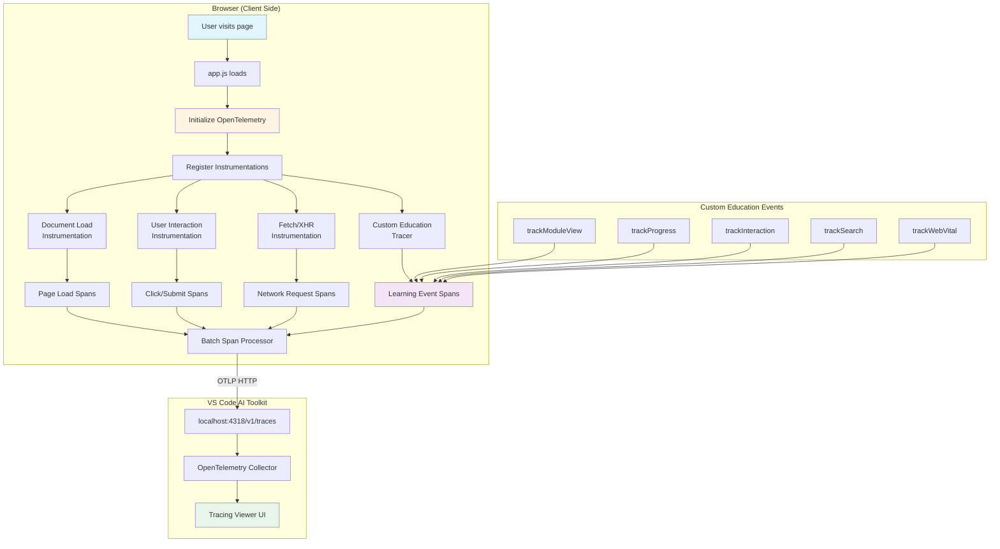

# OpenTelemetry Tracing for Let's Talk CDC

This document describes the client-side tracing implementation for the Let's Talk CDC educational site.

## Table of Contents

- [Quick Start](#quick-start)
- [Overview](#overview)
- [Architecture](#architecture)
- [Custom Tracking](#custom-tracking)
- [Session Management](#session-management)
- [Viewing Traces](#viewing-traces)
- [Development](#development)
- [Production Considerations](#production-considerations)
- [Dependencies](#dependencies)
- [Troubleshooting](#troubleshooting)
- [Future Enhancements](#future-enhancements)

---

## Quick Start

### 1. View Traces in AI Toolkit

The tracing viewer can be accessed in VS Code via:

**View → AI Toolkit → Tracing**

### 2. Test the Tracing

With the dev server running at http://localhost:8080/:

1. **Open your browser** and navigate to http://localhost:8080/
2. **Browse modules** - Visit any learning module (e.g., `/intro/`, `/snapshotting/`)
3. **Search** - Press `/` and search for something (e.g., "kafka")
4. **Copy code** - Click any "Copy" button on code blocks
5. **Complete tasks** - Check off items in learning modules

### 3. View the Traces

Return to VS Code and check the **AI Toolkit Tracing panel**. You should see:

- **documentLoad** spans - Page load performance
- **module.view** spans - When you visited a module
- **search.query** spans - Your search queries
- **learning.interaction** spans - Code copy events
- **web.vital** spans - Core Web Vitals metrics
- **user-interaction** spans - Click events
- **fetch** spans - Network requests

### 4. Inspect Trace Details

Click any span to see:

- **Timing information** - Duration, start time
- **Attributes** - Module keys, search queries, success flags
- **Context** - Session ID, page path, user agent
- **Relationships** - Parent/child span connections

---

## Overview

The site uses a **lightweight OpenTelemetry-compatible tracer** to track:

- 📊 **Page Load Performance** - Document load timing, resource loading
- 👆 **User Interactions** - Clicks, form submissions, navigation
- 📈 **Learning Progress** - Module completion, step tracking
- 🔍 **Search Queries** - Search usage and result counts
- 📄 **Code Copy Events** - Track when users copy code snippets
- ⚡ **Core Web Vitals** - LCP, FID, CLS metrics

## Architecture

### System Flow



### Implementation Approach

The site uses **`tracing-lite.js`** — a custom, dependency-free implementation that:

✅ **No bundler required** — Works directly in browsers via ES modules  
✅ **No npm dependencies at runtime** — Only uses browser fetch API  
✅ **OTLP-compatible** — Sends standard OpenTelemetry protocol traces  
✅ **Progressive enhancement** — Site works even if tracing fails

> **Note**: The site uses a custom, dependency-free OTLP-compatible
> tracer rather than the full `@opentelemetry/*` SDKs. The SDK-based
> implementation was removed in the Month-0 cleanup after sitting unused
> since 2.0.0. If you ever need full SDK features (e.g. richer
> instrumentations), reintroduce the dependencies and write a fresh
> implementation against the current `tracing-lite.js` API surface.

### Components

1. **`src/assets/js/tracing-lite.js`** - Lightweight tracer implementation
   - Custom `EducationTracer` class for educational event tracking
   - OTLP trace formatting and export
   - Core Web Vitals integration
   - No external dependencies

2. **`src/assets/js/app.js`** - Integration points
   - Imports and initializes tracer on page load
   - Tracks module views, progress updates, searches, and interactions
   - Graceful fallback if tracing fails

### Trace Destination

Traces are exported to the **AI Toolkit tracing viewer** via OTLP HTTP:

- **Endpoint**: `http://localhost:4318/v1/traces`
- **Protocol**: OTLP/HTTP
- **Format**: OpenTelemetry Protocol (JSON)
- **Transport**: Browser fetch API

## Custom Tracking (Automatic via tracing-lite.js)

The lightweight tracer automatically tracks:

### Page Load Performance

- Uses `PerformanceNavigationTiming` API
- Tracks DNS, TCP, TLS, request, response timings
- Records resource load metrics

### Core Web Vitals

- **LCP** (Largest Contentful Paint)
- **FID** (First Input Delay)
- **CLS** (Cumulative Layout Shift)
- Uses `web-vitals` library patterns

## Custom Tracing

### Module View Tracking

Automatically triggered on page load when a journey/module is detected:

```javascript
educationTracer.trackModuleView(moduleKey, moduleTitle);
```

**Attributes**:

- `module.key` - Unique module identifier (e.g., 'intro', 'snapshotting')
- `module.title` - Page title
- `user.session_id` - Session identifier

### Progress Tracking

Triggered when users complete steps in learning modules:

```javascript
educationTracer.trackProgress(moduleKey, stepNumber, percentComplete);
```

**Attributes**:

- `module.key` - Module identifier
- `learning.step` - Current step number
- `learning.percent_complete` - Completion percentage (0-100)
- `user.session_id` - Session identifier

### Interactive Element Tracking

Tracks code copy operations and other interactions:

```javascript
educationTracer.trackInteraction(interactionType, elementId, success);
```

**Attributes**:

- `interaction.type` - Type of interaction (e.g., 'code-copy')
- `interaction.element_id` - DOM element identifier
- `interaction.success` - Boolean success flag
- `user.session_id` - Session identifier

### Search Tracking

Automatically triggered when users search:

```javascript
educationTracer.trackSearch(query, resultsCount);
```

**Attributes**:

- `search.query` - Search query string
- `search.results_count` - Number of results found
- `user.session_id` - Session identifier

### Core Web Vitals

Automatically tracked using Performance Observer API:

```javascript
educationTracer.trackWebVital(name, value, rating);
```

**Vitals tracked**:

- **LCP** (Largest Contentful Paint) - `< 2.5s` = good
- **FID** (First Input Delay) - `< 100ms` = good
- **CLS** (Cumulative Layout Shift) - `< 0.1` = good

**Attributes**:

- `vital.name` - Vital name (LCP/FID/CLS)
- `vital.value` - Measured value
- `vital.rating` - 'good', 'needs-improvement', or 'poor'
- `page.path` - Page pathname

## Session Management

Each user session gets a unique session ID stored in `sessionStorage`:

```javascript
session_<timestamp>_<random>
```

This allows correlation of traces across a single user session without persistent cookies.

## Viewing Traces

### Using AI Toolkit

1. Open AI Toolkit in VS Code
2. Navigate to the **Tracing** panel
3. The trace collector starts automatically
4. Build and serve the site: `npm run dev`
5. Navigate to `http://localhost:8080`
6. Interact with the site (search, copy code, complete modules)
7. View traces in the AI Toolkit tracing panel

### Trace Data Structure

Traces are organized as spans with the following structure:

```
documentLoad
├─ documentFetch
├─ resourceFetch (multiple)
└─ performancePaint

userInteraction (click)

module.view
learning.progress
learning.interaction
search.query
web.vital
```

## Development

### Local Development

The tracing is automatically initialized when `app.js` loads. No additional setup required beyond:

1. **Install dependencies**: `npm install`
2. **Start AI Toolkit tracing viewer**: View → AI Toolkit → Tracing
3. **Run dev server**: `npm run dev`
4. **Browse the site**: Traces appear automatically in AI Toolkit

### Implementation Details

**File**: `src/assets/js/tracing-lite.js`

- ~364 lines of vanilla JavaScript
- No build step required
- Uses ES modules (`import/export`)
- Implements OTLP trace format manually
- Falls back gracefully if collector unavailable

**File**: `src/assets/js/app.js`

- Imports `getEducationTracer()` from `tracing-lite.js`
- Initializes tracer with try/catch
- Creates no-op tracer if initialization fails
- Tracks module views, progress, interactions, searches

### Error Handling

The tracing implementation includes graceful error handling:

- If OpenTelemetry fails to initialize, a no-op tracer is created
- Tracking failures are logged to console.debug (not shown by default)
- Site functionality continues normally even if tracing fails

### Debugging

The lite tracer logs failures via `console.debug`, which is hidden by
default in DevTools. Enable "Verbose"-level logs to see them.

## Production Considerations

### Performance Impact

- **Minimal overhead**: Batch span processor buffers traces
- **Async export**: Traces sent asynchronously, no UI blocking
- **Selective sampling**: Only meaningful interactions tracked

### Privacy

- **No PII collected**: No user identifiers, emails, or sensitive data
- **Session-only storage**: Session IDs stored in sessionStorage (cleared on tab close)
- **Local-only by default**: Traces sent to localhost (development only)

### Production Deployment

For production use, you would need to:

1. Configure a production-ready OTLP endpoint
2. Add authentication headers to the exporter
3. Consider trace sampling to reduce data volume
4. Update the exporter configuration:

```javascript
const exporter = new OTLPTraceExporter({
  url: "https://your-otel-collector.example.com/v1/traces",
  headers: {
    Authorization: "Bearer YOUR_TOKEN",
  },
});
```

## Dependencies

None — `tracing-lite.js` is a dependency-free implementation that emits
OTLP-formatted JSON via the Fetch API.

## Troubleshooting

### Traces Not Appearing

1. **Check AI Toolkit**: Ensure tracing viewer is open
2. **Check Console**: Look for "✓ OpenTelemetry tracing initialized" message
3. **Check Network**: Verify POST requests to `localhost:4318/v1/traces`
4. **Check Endpoint**: Ensure AI Toolkit collector is running

### CORS Errors

The AI Toolkit OTLP endpoint should handle CORS automatically. If you see CORS errors:

1. Restart VS Code
2. Restart AI Toolkit extension
3. Check that no other process is using port 4318

### Build Errors

If you encounter module resolution errors:

```bash
# Clear node_modules and reinstall
rm -rf node_modules package-lock.json
npm install
```

## Future Enhancements

Potential improvements:

- [ ] Add trace context propagation to Appwrite API calls
- [ ] Track quiz/exercise completion rates
- [ ] Add custom metrics (counters, gauges) for learning analytics
- [ ] Implement sampling strategies for production
- [ ] Add distributed tracing for serverless functions
- [ ] Create dashboards for learning analytics

## References

- [OpenTelemetry JavaScript Documentation](https://opentelemetry.io/docs/instrumentation/js/)
- [Web SDK Guide](https://opentelemetry.io/docs/instrumentation/js/instrumentation/)
- [AI Toolkit Tracing](https://github.com/microsoft/vscode-ai-toolkit)
- [OTLP Specification](https://opentelemetry.io/docs/specs/otlp/)
