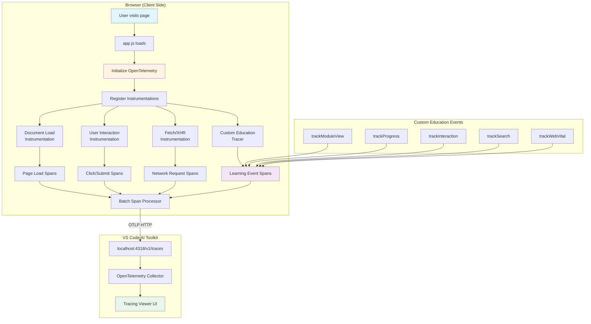

```mermaid
graph TB
    subgraph "Browser (Client Side)"
        A[User visits page] --> B[app.js loads]
        B --> C[Initialize OpenTelemetry]
        C --> D[Register Instrumentations]

        D --> E1[Document Load<br/>Instrumentation]
        D --> E2[User Interaction<br/>Instrumentation]
        D --> E3[Fetch/XHR<br/>Instrumentation]
        D --> E4[Custom Education<br/>Tracer]

        E1 --> F1[Page Load Spans]
        E2 --> F2[Click/Submit Spans]
        E3 --> F3[Network Request Spans]
        E4 --> F4[Learning Event Spans]

        F1 --> G[Batch Span Processor]
        F2 --> G
        F3 --> G
        F4 --> G
    end

    subgraph "VS Code AI Toolkit"
        G -->|OTLP HTTP| H[localhost:4318/v1/traces]
        H --> I[OpenTelemetry Collector]
        I --> J[Tracing Viewer UI]
    end

    subgraph "Custom Education Events"
        K1[trackModuleView] --> F4
        K2[trackProgress] --> F4
        K3[trackInteraction] --> F4
        K4[trackSearch] --> F4
        K5[trackWebVital] --> F4
    end

    style A fill:#e1f5ff
    style C fill:#fff4e1
    style J fill:#e8f5e9
    style F4 fill:#f3e5f5
```
